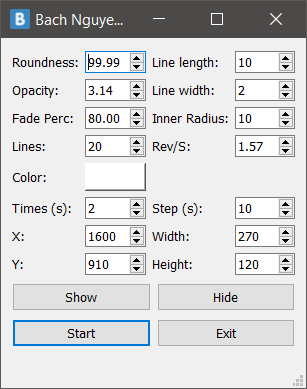
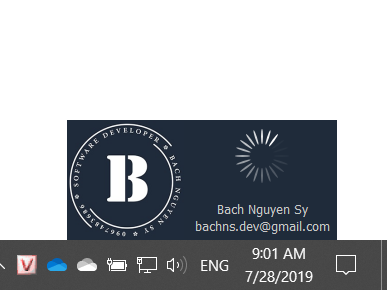

# PopupNotification
Khi chúng ta quay màn hình để làm các video hướng dẫn, dạy học... và muốn nhúng các thông báo bản quyền của mình vào các video đó. Chương trình sẽ giúp tự động hiển thị thông báo bản quyền theo các khoảng thời gian tùy chỉnh.
 
 
